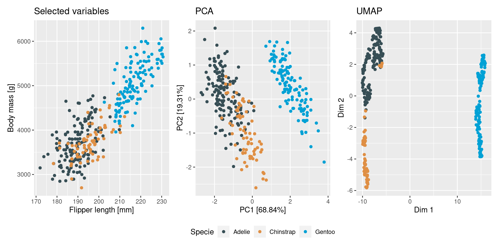
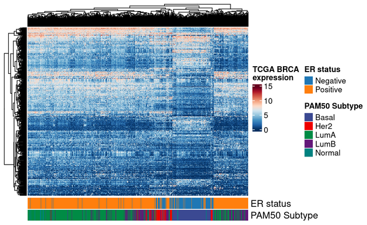

NGSchool2022 materials
================

Welcome to the [NGSchool2022: Machine Learning in Computational
Biology](https://ngschool.eu/ngschool2022/) materials. Here you will be
able to find links to slides, materials, repositories with code and for
some lectures videos.

Some videos are available publicly, while some are restricted to
participants of the school - they will be marked with :lock: and will
require a password to access.

Enjoy!

Workshops are marked with :computer:, panel discussion with
:speech_balloon: and lectures with :mega:.

## Day 0 \[15/09/2022\]

### :computer: Introduction to biostatistics

### :speech_balloon: Introduction to Machine Learning

Discussion panel moderated by Gladys Wojciechowska with Nuno Sepúlveda,
[Kaspar Märtens](https://kaspar.website/), German Demidov, Anamaria
Elek, Karolina Sienkiewicz and [Kasia Kędzierska](https://kasia.codes/)
as panelists.

## Day 1 \[16/09/2022\]

### :mega: Introduction to linear modeling

### :computer: Regression models

### :computer: Regularization for linear models

### :mega: Unsupervised learning - part 1

Lecture led by [Kaspar Märtens](https://kaspar.website/) and [Kasia
Kędzierska](https://kasia.codes/). Slides will be soon available here.

## Day 2 \[17/09/2022\]

### :mega: Model explainability

Lecture by [Krzysztof Geras](https://cs.nyu.edu/~kgeras/).

### :computer: Cross-validation and model evaluation

Session led by German Demidov. Slides are available
[here](day2/Model_evaluation-5.pdf).

### :computer: Unsupervised learning - part 2

Session led by [Kasia Kędzierska](https://kasia.codes/) and [Kaspar
Märtens](https://kaspar.website/). Github repository:
[ngs22_unsupervised](https://github.com/kzkedzierska/ngs22_unsupervised).

### :mega: Clustering in Computational Biology

Lecture by Karolina Sienkiewicz (feat. [Kaspar
Märtens](https://kaspar.website/)). Slides are available
[here](day2/Clustering_in_comp_bio.pdf).

## Day 3 \[18/09/2022\]

### :computer: Linear models in gene expression analysis

Session led by Urszula Smyczyńska.

### :mega: Deep Learning in Computational Biology

Lecture by [Leopold
Parts](https://www.sanger.ac.uk/person/parts-leopold/).

### :mega: Evaluation of AI models

Lecture by [Krzysztof Geras](https://cs.nyu.edu/~kgeras/).

## Day 4 \[19/09/2022\]

### :mega: Natural Language Processing

Lecture by [Noura Al
Moubayed](https://www.durham.ac.uk/staff/noura-al-moubayed/).

### :computer: Natural Language Processing

Session led by [Noura Al
Moubayed](https://www.durham.ac.uk/staff/noura-al-moubayed/) & Sean
Farrell.

### :mega: Tree-based methods

Lecture by Maja Kuzman.

### :computer: Tree-based methods

Session led by Maja Kuzman & Anamaria Elek.

## Day 5 \[20/09/2022\]

### :computer: Feature selection

Session led by Miron Kursa.

### :computer: Survival analysis

Session led by German Demidov.

## Day 6 - 7 \[21-22/09/2022\]

### Deep Learning in practice

Sessions led by Dmytro Fishman.
